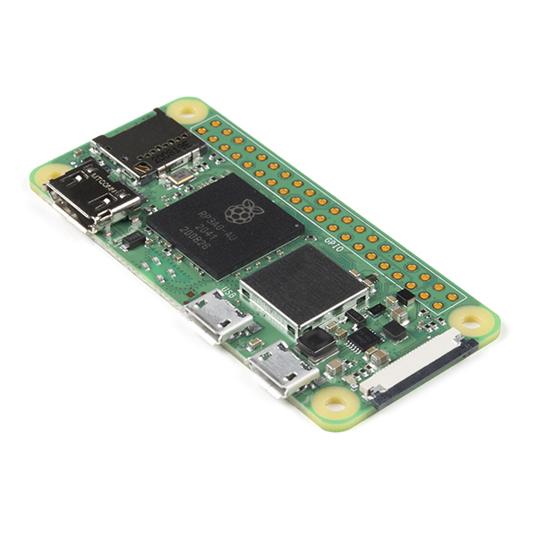

# PI-Bunny

### 0x00 About.
This is a project that mimics the [HAK5 Bash Bunny](https://docs.hak5.org/bash-bunny), using a Raspberry Pi Zero 2 W along with simple switches and RGB LEDs. With a homemade Pi Zero 2 W USB module and case, the cost is only about 1/10th of the Bash Bunny. Since it is based on the Raspberry Pi, I call this project "PI-Bunny".

### 0x01 Features.
#### Plug & Play USB emulation 
- USB OTG functions:
  - USB (RNDIS & ECM) Enternet
  - Serial
  - HID (Keyboard & Mouse)
  - Mass Storage
- Runtime reconfiguration of USB stack (no reboot)
#### Payloads
- Uses Almost the same payloads as bash bunny.
#### Bluetooth
- BLE-spam
  - Using [ECTO-1A/AppleJuice](https://github.com/ECTO-1A/AppleJuice) Apple BLE Proximity Pairing Message Spoofing.
- ...
#### WiFi
- Easy STA configuration (`/boot/wpa_supplicant.conf`)
- ...
#### NetWorking
- Using `udhcp` as DHCP server
- Support for DHCP client mode
- Manual configuration
### 0x02 Hardware.
#### You need:
- Raspberry pi zero 2w  [Amazon](https://www.amazon.com/Raspberry-Quad-core-Bluetooth-onboard-Antenna/dp/B0CCRP85TR)
  - 

- USB to DIP 4x2.54 adapter [Amazon](https://www.amazon.com/MELIFE-Converter-2-54mm-Adapter-Breadboard/dp/B07W6T9KPJ)  
  - 
- 2P DIP Switch [Amazon](https://www.amazon.com/Position-Toggle-Switch-2-54MM-Switches/dp/B09T5LQN5N)
  - 
- Aluminum Alloy Protection case [Amazon](https://www.amazon.com/TUOPUONE-Aluminum-Protection-Compatibe-Raspberry/dp/B0CNZ9RJWM)
  - 
- 3D Print Modules (in ./3dp/)
- 1x WS2812b 5050 SMD RGB LED 
  - 

#### Assembly completed:
   
 
 
 
