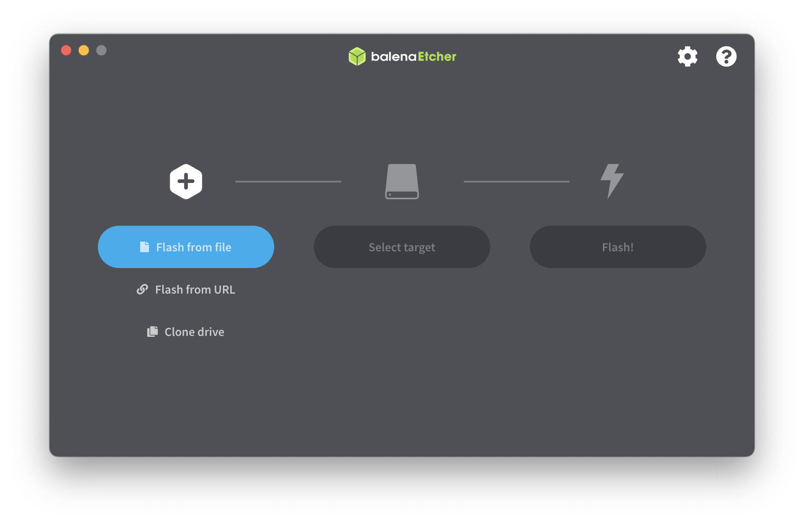

# PI-Bunny


### 0x00 About.
This is a project that mimics the [HAK5 Bash Bunny](https://docs.hak5.org/bash-bunny), using a Raspberry Pi Zero 2 W along with simple switches and RGB LEDs. With a homemade Pi Zero 2 W USB module and case, the cost is only about 1/10th of the Bash Bunny. Since it is based on the Raspberry Pi, I call this project "PI-Bunny".

### 0x01 Features.
#### Plug & Play USB emulation 
- USB OTG functions:
  - USB (RNDIS & ECM) Enternet
  - Serial
  - HID (Keyboard & Mouse)
  - Mass Storage
- Runtime reconfiguration of USB stack (no reboot)
#### Payloads
- Uses Almost the same payloads as bash bunny.
#### Bluetooth
- BLE-spam
  - Using [ECTO-1A/AppleJuice](https://github.com/ECTO-1A/AppleJuice) Apple BLE Proximity Pairing Message Spoofing.
- ...
#### WiFi
- Easy STA configuration (`/boot/wpa_supplicant.conf`)
- ...
#### NetWorking
- Using `udhcp` as DHCP server
- Support for DHCP client mode
- Manual configuration
### 0x02 Hardware.
#### You need:
- Raspberry pi zero 2w  [Amazon](https://www.amazon.com/Raspberry-Quad-core-Bluetooth-onboard-Antenna/dp/B0CCRP85TR)
  - 

- USB to DIP 4x2.54 adapter [Amazon](https://www.amazon.com/MELIFE-Converter-2-54mm-Adapter-Breadboard/dp/B07W6T9KPJ)  
  - 
- 2P DIP Switch [Amazon](https://www.amazon.com/Position-Toggle-Switch-2-54MM-Switches/dp/B09T5LQN5N)
  - 
- Aluminum Alloy Protection case [Amazon](https://www.amazon.com/TUOPUONE-Aluminum-Protection-Compatibe-Raspberry/dp/B0CNZ9RJWM)
  - 
- 3D Print Modules (in ./3dp/)
- 1x WS2812b 5050 SMD RGB LED 
  - 

- San Disk Extreme A1 V30 (recommend)
  - 

#### Assembly completed:
   
 
 
 

### 0x03 Build system images
#### Build-Scripts
 - Using [kali linux arm build scripts](https://gitlab.com/kalilinux/build-scripts/kali-arm)
#### Building
```bash
cd ~/
git clone https://gitlab.com/kalilinux/build-scripts/kali-arm
cd ~/kali-arm/
cp ./builder.txt.example ./builder.txt
```
Use your favorite text editor to edit `./builder.txt`

```bash
nvim ./builder.txt
```

```bash
# Version Kali release
#version=${version:-$(cat .release)}

# Custom hostname variable
#hostname=kali

# Choose a locale
#locale="en_US.UTF-8"

# Free space added to the rootfs in MiB
#free_space="300"

# /boot partition in MiB
#bootsize="128"

# Select compression, xz or none
#compress="xz"

# Choose filesystem format to format (ext3 or ext4)
#fstype="ext4"

# Disable IPV6 (yes or no)
#disable_ipv6="yes"

# Make SWAP (yes or no)
#swap="no"

# DNS server
#nameserver="8.8.8.8"

# To limit the number of CPU cores to use during compression
# Use 0 for unlimited CPU cores, -1 to subtract 1 cores from the total
#cpu_cores="4"

# To limit the CPU usage during compression
# 0 or 100 No limit, 10 = percentage use, 50, 75, 90, etc.
#cpu_limit="85"

# If you have your own preferred mirrors, set them here.
#mirror="http://http.kali.org/kali"
#replace_mirror="http://http.kali.org/kali"

# Use packages from the listed components of the archive.
#components="main,contrib,non-free,non-free-firmware"

# Suite to use, valid options are:
# kali-rolling, kali-dev, kali-dev-only, kali-last-snapshot
#suite="kali-rolling"
#replace_suite="kali-rolling"

# Default file name
# On the RPi 3 script, this would result in
# "kali-linux-202X-WXX-rpi4-nexmon-arm64" for the default filename.
# For release builds from Kali, the requirements are that it start with kali-linuxi
# and end with the architecture.
#image_name="kali-linux-$(date +%Y)-W$(date +%U)-${hw_model}-${variant}"
```
Make sure you run the `./common.d/build_deps.sh` script before trying to build an image, as this installs all required dependencies.  You may need to reboot after installing the build dependencies, if you do, the script will mention it at the end.
```bash
sudo ./common.d/build_deps.sh
```
Now, just run the build build scripts. We don't use any desktop environment, so use option `--desktop=none`
```bash 
sudo ./raspberry-pi-zero-2-w-pitail.sh --desktop=none --arch=armhf
```
The reason I use `./raspberry-pi-zero-2-w-pitail.sh` is because it is easier to change the default configuration of Pi-tail.

Depending on your system hardware & network connectivity, will depend on how long it will take to build (4 core CPU, 8GB RAM, SSD inside a VM takes using a local repo about 100 minutes per script)

On x64 systems, after the script finishes running, you will have an image file located in `~/kali-arm/images/` called `kali-linux-202x.x-<rpi...>-armhf.img.xz`

On x86 systems, as they do not have enough RAM to compress the image, after the script finishes running, you will have an image file located in `~/kali-arm/images/` called `kali-linux-202x.x-<rpi...>-armhf.img`
#### Flash to SD card
You can use Raspberry Pi imager or Balena Etcher.

  

#### Boot configuration
copy `./config/*` to `boot`(your SD card) and use your favorite text editor to edit `interfaces` and `wpa_supplicant.conf`

`interfaces`:
```bash
auto lo
iface lo inet loopback

auto pan0
iface pan0 inet dhcp
  bridge_stp off
  bridge_ports none

# WiFi AP = Disable ## Leave commented out, only define Enable OR Disable
                    ## When enabled, comment out the wlan0 stanza
allow-hotplug wlan0
iface wlan0 inet manual
  wpa-roam /etc/wpa_supplicant/wpa_supplicant.conf
  post-up iw wlan0 set power_save off

iface home inet dhcp

iface iphone inet dhcp


# Android defaults
allow-hotplug usb0
iface usb0 inet static
    address 192.168.0.1
    netmask 255.255.255.0
    gateway 192.168.0.1

# PC
allow-hotplug usb9
iface usb9 inet static
    address 192.168.44.254
    netmask 255.255.255.0
##    gateway 192.168.44.1

allow-hotplug eth0
iface eth0 inet dhcp
```
>note: interface `usb0` is for USB RNDIS or ECM Enternet attack

`wpa_supplicant.conf`:
```bash
# reading passphrase from stdin
network={
	ssid="Your_AP"
	psk="p@ssw0rd123"
        id_str="home"
        priority=1
}

network={
	ssid="Your_Phone"
	psk="p@ssw0rdxxx"
	id_str="iphone"
	priority=2
}
```

### 0x04 Install
#### First boot
Boot your device and it should automatically connect to your wifi.

ssh to your pi, you can use `arp-scan -I <interface> --localnet` to find IP address. username and password is `kali/kali`.

`ssh kali@192.168.0.4`

- 1 .  Change your root password: 

  - 

- 2 .  Edit `/etc/ssh/sshd_config` to allow root login

  - `PermitRootLogin yes`

- 3 . Download the repository:

    ```bash
    cd ~ 
    git clone https://github.com/KaliAssistant/PI-Bunny.git
    cd PI-Bunny
    ```
- 4 . Run install script:
 
    ```bash
    cd install
    chmod +x install.sh
    sudo ./install.sh
    ```

- 5 . reboot.

    `reboot`

### 0x05 Payloads
Example payloads in `./payloads`

### 0xFF
Enjoy it !

### Copyright
PI-Bunny

email: [work.kaliassistant.github@gmail.com]([work.kaliassistant.github@gmail.com)

This program is distributed in the hope that it will be useful, but WITHOUT ANY WARRANTY; without even the implied warranty of MERCHANTABILITY or FITNESS FOR A PARTICULAR PURPOSE. See the GNU General Public License for more details.

You should have received a copy of the GNU General Public License along with this program. If not, see [http://www.gnu.org/licenses](http://www.gnu.org/licenses).


